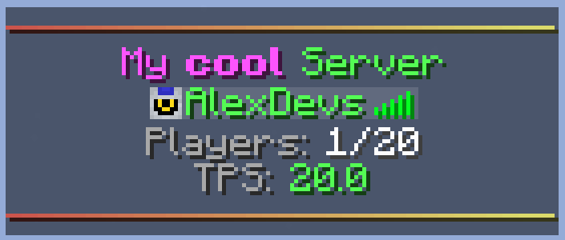

# Player Tab List

The header and footer of the player tab list can be customized with multiple lines of formattable text.

## Configuring

The player tab list can be configured from the config file in the `custom-tab-list` section.

### Enable tab list - `enable-tab-list`

Whether to enable the tab list customization.

### Player display name in tab - `player-tab-name`

Display name of the player to show in the tab list.

### Header & footer - `tab-header` & `tab-footer`

The header and footer are list of formattable text lines that take the placeholder context of the player.

### Tab list delay - `tab-list-delay`

Milliseconds to wait for the next tab list update.