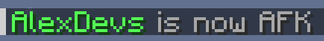

# AFK

The AFK (away-from-keyboard) module tracks players active time and automatically flags them as "AFK" after a configurable time span of inactivity.

The placeholder `solstice:afk` displays an AFK tag.

Activity is currently tracked by:

- Player movement
- Chat messages and commands
- Block and entity events
- Item use events

The `/afk` command manually triggers AFK.

## Configuring

AFK can be configured in the `afk` section in the config file.

!!! config "enable"

    Whether to enable the AFK module. This setting requires a server restart.
    
    Use the `solstice.afk.base` permission node for fine tuning to specific users.

!!! config "time-trigger"

    How many seconds the player has to be inactive to trigger the AFK.
    

!!! config "announce"

    Whether to announce in chat a player has gone to or returned from AFK.

!!! config "tag"

    This tag is displayed with `solstice:afk` placeholder when the player is AFK.

### triggers

!!! config "on-movement"

    Trigger on player movement.

!!! config "on-look-change"

    Trigger on player changing head direction (yaw, pitch).

!!! config "on-chat"

    Trigger on chat messages (or attempt of).

!!! config "on-command"

    Trigger on command (or attempt of).

!!! warning "Fake players"

    The following events may be triggered by fake players, preventing the player from going AFK automatically.

!!! config "on-block-attack"

    Trigger on attack on block (dig, left click) event.

!!! config "on-block-interact"

    Trigger on interaction with block (place, right click) event.

!!! config "on-entity-attack"

    Trigger on attack on entity event.

!!! config "on-entity-interact"

    Trigger on interact with entity event.

!!! config "on-item-use"

    Trigger on item use event.

## Commands

!!! command "afk"

    Set player state as AFK.

    **Permissions**

    * `solstice.afk.base` - Default: true 
    Enable AFK feature for the player.

!!! warning "Permissions for commands below subject to changes."

!!! command "activetime"

    View your active time.

    **Permissions**

    * `solstice.afk.base` - Default: true

!!! command "activetime player &lt;player&gt;"

    View a player's active time.

    **Permissions**

    * `solstice.afk.others` - Default: 1

!!! command "activetime leaderboard"

    View a top 10 leaderboard of most active players.

    **Permissions**

    * `solstice.afk.leaderboard` - Default: true

!!! command "activetime set &lt;player&gt; [time]"

    Set the active time of a player.

    This command does not update the leaderboard.

    **Permissions**

    * `solstice.afk.set` - Default: 3