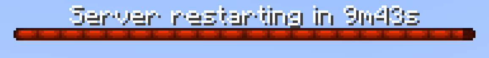

# Restart

The auto restart module automatically stops the server at exactly the time of day configured.

A boss bar will be displayed 10 minutes before restart, counting down each second until it hits 0.

Announcements will also be sent in chat, along an audible ping, at configured times to notify everyone.

## Configuring

This module can be configured in the `auto-estart` section of the config file.

### Enable Auto Restart - `enable`

Whether to enable the auto restart module.

### Restart At - `restart-at`

List of times to restart at, in 24h format (`"00:00"`, `"12:00"`, `"18:00"`), local to the server.

The module will restart the server at exactly the configured time.

### Restart notification milestones - `restart-notifications`

This list contains the milestones in seconds for chat announcements.

!!! example

    If the list contains the number `300` (5 minutes), the restart announcement will sent in chat when the remaining time is 5 minutes.

### Restart sound - `restart-sound`

This sound is played to all players when a restart announcement is sent in chat.

### Restart sound pitch - `restart-sound-pitch`

This value defines the pitch of the `restart-sound` sound.

## Locale

### Restart bar label - `barLabel`

This text will be displayed on top of the boss bar countdown.

The label updates every second.

#### Placeholders

- `${remaining_time}` - Time remaining.
- `${elapsed_time}` - Time elapsed.
- `${total_time}` - Total time of the countdown.

### Restart chat message - `chatMessage`

This message is displayed in chat when a milestone (`restart-notifications`) is hit.

#### Placeholders

- `${remaining_time}` - Time remaining.
- `${elapsed_time}` - Time elapsed.
- `${total_time}` - Total time of the countdown.

### Restart Kick Message - `restart-kick-message`

This message is used as kick message.

## Commands
!!! command "afk"

    Set player state as AFK.

    **Permissions**

    * `solstice.afk.base` - Default: t
    Enable AFK feature for the player.

!!! command "afk"

    Set player state as AFK.

    **Permissions**

    * `solstice.afk.base` - Default: t
    Enable AFK feature for the player.

!!! command "afk"

    Set player state as AFK.

    **Permissions**

    * `solstice.afk.base` - Default: t
    Enable AFK feature for the player.

!!! command "afk"

    Set player state as AFK.

    **Permissions**

    * `solstice.afk.base` - Default: t
    Enable AFK feature for the player.