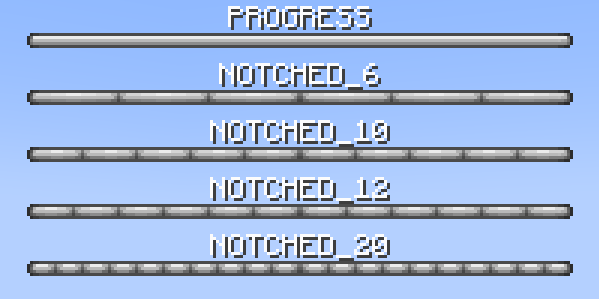

# Restart

The auto restart module automatically stops the server at exactly the time of day configured.

A boss bar will be displayed 10 minutes before restart, counting down each second until it hits 0.

Announcements will also be sent in chat, along an audible ping, at configured times to notify everyone.

## Configuration

This module can be configured in the `restart` section of the config file.

!!! config "enable"

    Whether to enable the auto restart module.

!!! config "restart-at"

    List of times to restart at, in 24h format (`"00:00"`, `"12:00"`, `"18:00"`), local to the server.

    The module will restart the server at exactly the configured time.

!!! config "restart-notifications"

    This list contains the milestones in seconds for chat announcements.

    !!! example

        If the list contains the number `300` (5 minutes), the restart announcement will be sent in chat when the remaining time is 5 minutes.

    The highest value in this setting defines when the restart countdown bar has to show up.

!!! config "restart-sound"

    This sound is played to all players when a restart announcement is sent in chat.

!!! config "restart-sound-pitch"

    This value defines the pitch of the `restart-sound` sound.

!!! config "bar-style"

    Style of the boss bar.

    **Possible values**

    * PROGRESS
    * NOTCHED_6
    * NOTCHED_10
    * NOTCHED_12
    * NOTCHED_20

    

!!! config "bar-color"

    Color of the boss bar.

    **Possible values**

    * PINK
    * BLUE
    * RED
    * GREEN
    * YELLOW
    * PURPLE
    * WHITE

    

## Locale

!!! locale "barLabel"

    This text will be displayed on top of the boss bar countdown.

    The label updates every second.

    **Placeholders**

    - `${remaining_time}` - Time remaining.
    - `${elapsed_time}` - Time elapsed.
    - `${total_time}` - Total time of the countdown.

!!! locale "chatMessage"

    This message is displayed in chat when a milestone (`restart-notifications`) is hit.

    **Placeholders**

    - `${remaining_time}` - Time remaining.
    - `${elapsed_time}` - Time elapsed.
    - `${total_time}` - Total time of the countdown.

!!! locale "kickMessage"

    This message is used as kick message.

## Commands

!!! command "restart now"

    Restart the server.

    **Permissions**

    * `solstice.restart.base` - Default: 4

!!! command "restart schedule next"

    Schedule the next configured restart (if canceled).

    **Permissions**

    * `solstice.restart.base` - Default: 4

!!! command "restart schedule &lt;timespan&gt; [message]"

    Start a manual restart countdown.

    **Permissions**

    * `solstice.restart.base` - Default: 4

!!! command "restart cancel"

    Cancel the running/scheduled restart.

    **Permissions**

    * `solstice.restart.base` - Default: 4