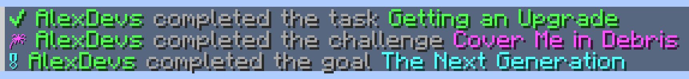

# Styling

This module adds chat formatting and limited toggleable Markdown formatting to player chats.

Also you can replace chunks of text with something else.

## Configuring

These options can be configured in the `chat` section of the config file.

### Markdown


#### Enable chat markdown - `enable-chat-markdown`

Whether to enable Markdown in chat.

#### Format

The format allows:

- **bold** `**bold**`
- *italic* `*italic*`
- <u>underline</u> `__underline__`
- ~~strikethrough~~ `~~strikethrough~~`
- [Links](https://example.com) `[URLs](https://example.com)` (it shows original URL when hovering over it)
- `quotes` `` `quotes` ``
- ||spoilers|| `||spoilers||` (it shows text when hovering over it)

### Welcome new players - `welcomeNewPlayers`

Enabling this will broadcast a welcome message to everyone when a player joins the server for the first time.

### Replacements - `replacements`

Chunks of texts can be replaced by configuring this key=value table.

You can add a replacement by adding a line like this to the list:

```hocon
"original"="replacement"
```

## Locale

## Advancements - `advancementTask`, `advancementChallenge`, `advancementGoal`

There are 3 kinds of advancements, called frames: **task**, **challenge**, **goal**.



You can read more about them in the [Minecraft Wiki](https://minecraft.wiki/w/Advancement).

The advancement titles and descriptions are automatically translated to the client's locale.

- `${title}` - Title of the advancement.
- `${description}` - Description of the advancement.

## Player chat messages - `chatFormat`

- `${message}` - The message content.


## Death messages - `deathFormat`

- `${message}` - The death message, it already contains the player name.


## Emote messages (`/me`) - `emoteFormat`

- `${message}` - The message content.

## Join message - `joinFormat`

- *No contextual placeholders*

## Join with a new username message - `joinRenamedFormat`

- `${previousName}` - Previous name of the player.

## Leave format - `leaveFormat`

- *No contextual placeholders*
- 
## Welcome - `welcome`

- *No contextual placeholders*