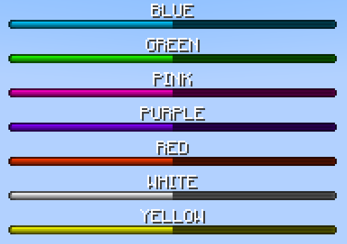
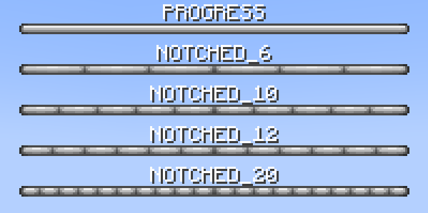

# Time Bar

This module is mainly used internally (specifically for the restart boss bar), but also adds the `/timebar` command to show a bossbar progressing and then executing a command once completed.

## Commands

!!! command "timebar start &lt;duration&gt; &lt;color&gt; &lt;style&gt; &lt;countdown&gt; &lt;label&gt; &lt;command&gt;"

    Start a time bar.

    **Arguments**

    * `duration` - time span of the time bar.
    * `color` - color of the boss bar.
    * `style` - style of the boss bar.
    * `countdown` - `true/false`, whether to countdown or progress.
    * `label` - formattable message to display on the bar.
    * `command` - command to execute after it completes.

    **Permissions**

    * `solstice.timebar.base` - Default: 3

!!! command "timebar cancel &lt;uuid&gt;"

    Cancel a time bar.

    **Permissions**

    * `solstice.timebar.base` - Default: 3

## Options

### Color

### Styles

